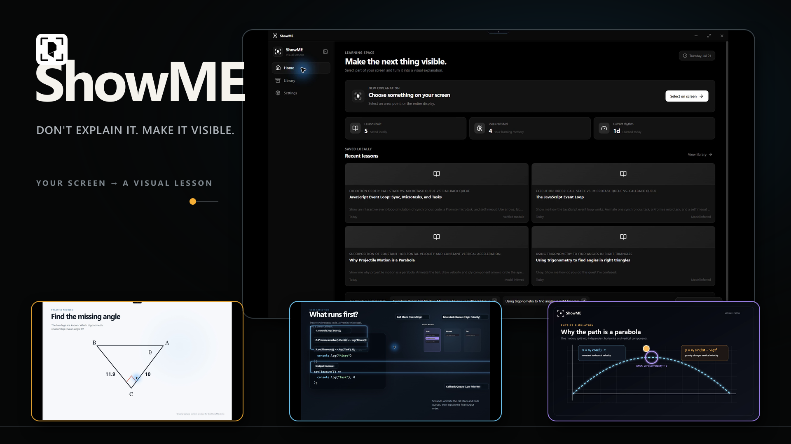

<p align="center">
  
</p>

<h1 align="center">ShowME</h1>

<p align="center"><strong>Don't explain it. Make it visible.</strong></p>

<p align="center">
  A Windows desktop app that turns anything on screen into a focused, interactive lesson.
</p>

<p align="center">
  
</p>

ShowME lives in a small island at the top of the screen. Say **ShowME** or choose an area, point, lasso, arrow, or full display. Ask a question by voice or text and ShowME builds a visual lesson around exactly what you selected.

## What it does

- Captures only after a deliberate selection or recognized wake phrase.
- Shows a live microphone spectrum while listening, a clear thinking state, and a blue screen-reading border while the model examines the capture.
- Turns model output into validated lesson steps, annotations, motion, controls, narration, and follow-up questions.
- Uses the learner's age and grade/learning level as a compact teaching baseline, while giving the learner's questions and feedback higher priority.
- Supports local Windows narration plus Deepgram Aura or ElevenLabs speech. OpenAI is never used for audio.
- Transcribes questions through Groq, Deepgram, or ElevenLabs.
- Stores lesson history locally and never stores the original screenshot in history.

## Run it

The tested release platform is Windows. Development requires Node.js 24+, Rust 1.92+, Python 3.12+, and PyInstaller.

```powershell
npm install
npm run build:workers
npm run build:icons
npm run dev
```

Enter API keys inside ShowME, not in `.env`. Saved keys are protected with Windows DPAPI. After a key is saved, ShowME reads that provider's live model catalog and limits the lesson selector to generative models, preferring models with verified image-input metadata. A catalog entry is not treated as proof of free or account-level access; the selected model must pass its connection test. The default shortcuts are `Ctrl+Shift+Space` for selection and `Ctrl+Shift+V` for voice-first capture.

## Built for trust

Model output is untrusted data. OpenAI uses a strict schema; compatible providers use the strongest contract their current API supports, followed by the same closed Zod schema, reference checks, numerical bounds, and independent verification worker before the renderer accepts anything. ShowME never runs model-authored HTML, JavaScript, SVG markup, shell commands, Python, or Rust.

The renderer is sandboxed with context isolation and no Node access. Capture, provider traffic, credentials, SQLite, and worker processes stay in Electron main. See [Privacy and security](PRIVACY-SECURITY.md) for the full boundary.

## Codex and GPT-5.6

I used Codex with GPT-5.6 throughout the Electron redesign to inspect the earlier Rust/Tauri prototype and five product specifications, trace behavior across renderer, IPC, native workers, providers, and packaging, and repeatedly test the Windows app. Codex accelerated the repository-wide debugging, provider adapters, schema work, coordinate handling, and verification gate. I made the product and safety decisions, including removing the pet, fixing the wake name to ShowME, requiring deliberate capture, keeping screenshots out of history, and rendering declarative lessons instead of model-generated interface code.

`gpt-5.6-sol` is also the default OpenAI lesson model. Its response must still pass ShowME's local validation before anything appears. The same validated pipeline can use another vision-capable model returned by the live catalog; the cost-controlled submission capture uses `gpt-5.4-mini` without a mocked lesson path. This repository is the July 2026 Electron/TypeScript replacement; the dated history distinguishes it from the earlier prototype.

## Verify and package

```powershell
npm run check
npm run pack
```

`npm run check` runs formatting, lint, TypeScript, renderer and schema tests, wake recognition tests, Rust tests, and Python tests. Packaging writes reproducible artifacts to `release/`.

## Project map

| Path | Purpose |
| --- | --- |
| `src/main` | Electron authority, capture, providers, credentials, windows, and storage |
| `src/renderer` | Main app, selection tools, dynamic island, and click-through desktop whiteboard |
| `src/shared` | Types, schemas, models, geometry, and simulations |
| `workers` | Rust capture/credential worker, Python verifier, and local wake listener |
| `tests` | Provider, schema, simulation, storage, and interface tests |

[Architecture](ARCHITECTURE.md) · [Quality assurance](QA.md) · [Research notes](RESEARCH.md) · [Apache-2.0 license](LICENSE)
