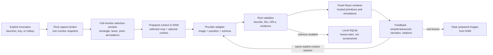

# ShowME architecture

## Product invariant

ShowME turns an explicitly selected piece of screen content into a small interactive visual lesson. It does not continuously observe the desktop, diagnose the learner, or allow a model to generate executable application code.

The primary architectural decision is to treat model output as untrusted data crossing into a privileged desktop process. The model can choose from a bounded visual vocabulary; the application owns capture, credentials, validation, simulation math, rendering, persistence, and external navigation.

## System flow

## Process and trust boundaries

### Native Rust core

The Rust core is the privileged broker. It owns:

- OS windows, tray, global shortcut, close-to-hide, and single-instance behavior
- screen and active-window capture
- the in-memory capture lifecycle
- provider HTTP clients and API-key access
- OpenAI speech-to-text and text-to-speech calls
- Wikimedia Commons metadata requests
- strict request and response validation
- SQLite persistence and JSON export
- external URL validation before handing a link to the OS

The frontend receives only the data needed for the current view through named Tauri commands. The Tauri capability file grants bundled windows event access and drag-region access; it does not expose shell or general filesystem commands.

### WebView frontend

React owns interaction and presentation: onboarding, settings, capture markup, the launcher question panel, history, lesson playback, citations, controls, feedback, and accessibility preferences. It never receives or persists provider API keys. Network destinations are reached from Rust, not with a general-purpose browser fetch surface.

### Provider boundary

Screen material, copied text, source text, and provider responses are untrusted. The compiler system prompt labels all supplied material as study content and explicitly forbids following instructions embedded inside it. This is defense in depth, not the enforcement boundary: Rust independently enforces size limits, model/capability compatibility, URL schemes, coordinate ranges, unique IDs, referenced IDs, finite control ranges, supported bindings, scene caps, and citation provenance.

## Capture lifecycle

1. `begin_capture` is called only by an explicit user action.
2. Rust captures the monitor under the pointer, or the primary monitor as a fallback. The Windows build enables xcap’s Windows Graphics Capture backend.
3. A physical-pixel, always-on-top selection window covers that monitor and receives the captured PNG as a data URL.
4. The user sends one to forty normalized regions. Coordinates use `[0, 1000]` in both axes, independent of CSS size and display scale.
5. Rust validates the regions, computes a padded physical crop, and replaces the pending snapshot with a prepared in-memory context.
6. The selected crop is always available. The full nearby image and separately captured active window are included in a provider request only when the matching switches are on.
7. `end_lesson_context`, cancellation, or the next capture clears prepared image bytes. SQLite never stores those bytes.

The normalized coordinate space is deliberately shared by selection regions, lesson primitives, source-region links, and responsive rendering. Physical pixels exist only at capture/crop boundaries.

## Lesson compiler contract

`LessonPlan` version 1 contains:

- title, concept, summary, teaching mode, confidence, uncertainty, and narration
- bounded visual primitives in normalized coordinates
- ordered steps with durations and checkpoints
- numeric controls bound to supported simulation fields
- one optional verified or declarative simulation specification
- claims with explicit evidence kinds and citation IDs
- citations, follow-up prompts, and provider/model provenance

The provider path is:

1. build a prompt from the user question, selection metadata, optional copied/source context, complexity, and teaching style;
2. attach allowed images based on effective model capabilities;
3. request strict JSON when the route supports it;
4. parse JSON into the Rust model;
5. validate all semantic invariants and bounded resources;
6. replace provider identity with the actual selected provider/model;
7. retain only citations that can be tied to a user URL or real provider URL annotations;
8. render and optionally persist the validated plan.

Invalid output is rejected with a typed remediation message. There is no fallback that evaluates model-produced source code.

## Provider adapters

OpenAI uses `POST /v1/responses` with GPT-5.6 Sol by default, structured output, image input, and optional `web_search`. URL annotations from the response are collected separately and reconciled with the plan.

Alibaba Cloud Qwen uses the US (Virginia) pay-as-you-go OpenAI-compatible endpoint with the US-scoped `qwen3.7-plus-us` model by default. It receives documented Base64 `image_url` inputs in non-thinking JSON mode, followed by the same Rust parsing and semantic validation as every route.

NVIDIA NIM, Groq, Cerebras, and OpenRouter use provider-specific OpenAI-compatible chat-completions endpoints. Capabilities are conservative defaults plus explicit user overrides because schema and image support depend on the exact model. OpenRouter requests `require_parameters` so a route cannot silently discard required structured-output parameters.

No compatible-provider adapter is allowed to pretend it performed web research. The current grounded research route is OpenAI-only; other routes return a capability error when that switch is on.

## Rendering and simulations

The renderer maps each primitive kind to a fixed React/SVG component. Text is rendered as text, not HTML. Styling tokens are selected by the app. Primitive and scene limits prevent unbounded DOM/SVG work.

Verified simulation modules own the behavior and math for:

- orbital mechanics, including deterministic outcome classification and energy
- projectile motion
- trigonometry and its linked visual representations
- waves
- simple circuits
- JavaScript event-loop traces
- common function graphs

When no verified module fits, the model may return a bounded custom scene made only of circles, rectangles, arrows, and five predefined motion types. `public/sandbox.js` interprets that data in a sandboxed iframe. The schema has no executable-code or URL field.

Reduced motion disables or minimizes nonessential animation and leaves manual controls usable. Lesson stages expose labels and accompanying text instead of making animation the only carrier of meaning.

## Persistence

SQLite uses WAL mode and contains three tables:

- `settings`: the serialized application settings record
- `lessons`: question, provider/model, confidence, source description, validated plan JSON, and optional feedback
- `preference_feedback`: reserved local preference signals

Memory can be disabled. Export produces a versioned JSON document. Deleting all memory removes lessons and preference feedback while preserving settings; individual lessons can also be deleted.

Provider keys are separate from SQLite. The Rust `keyring` backend stores one credential per provider under the service `com.showme.visual.provider`, mapping to Windows Credential Manager or macOS Keychain.

## Window model

- `main`: frameless, resizable application window; close hides instead of terminating
- `pet`: transparent, always-on-top, skip-taskbar invocation surface; its native hit area is 48 × 24 while idle, grows only on hover/menu use, and expands into the crop/question panel
- `selection`: ephemeral full-monitor physical-pixel overlay
- tray: new lesson, open, settings, and explicit quit
- global shortcut: `CommandOrControl+Shift+Space` by default and user-configurable

The CSP denies objects, remote scripts, remote frames, and arbitrary connections. Images allow local/data/blob content plus `https://upload.wikimedia.org`; external source links open through a validated native command.

## Platform notes

The capture layer uses xcap with the WGC feature on Windows and its OS abstraction on macOS. The packaged minimum macOS version is 12.3, consistent with modern ScreenCaptureKit availability, but the current release has not been compiled or permission-tested on macOS. Production work should verify multiple-monitor origins, mixed-DPI displays, protected-content behavior, Screen Recording revocation, signing, notarization, sandbox entitlements, and Apple Silicon packaging on Apple hardware.
